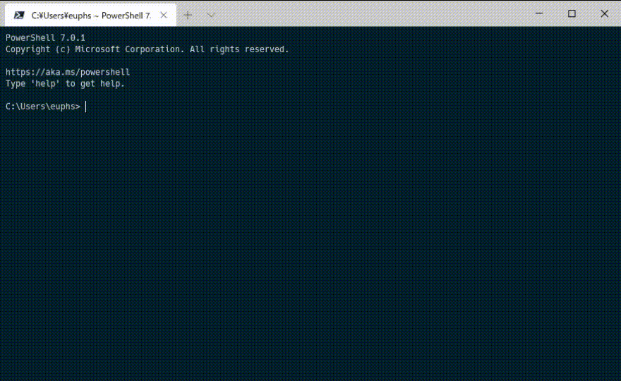

# WslGitSwitcher

  

Windows上のGitリポジトリ と WSL(Linux)上のリポジトリで、Gitインスタンスを自動的に切り替えて実行します。  
渡された引数は、そのままGit for Windows/wslgitへ渡されます。

## Require

* [Windows Subsystem for Linux(WSL)](https://docs.microsoft.com/ja-jp/windows/wsl/install-win10)
* [Git for Windows](https://gitforwindows.org/)

## Install

1. [Releases](releases/latest)から `WslGitSwitcher-1.0.0.zip` をダウンロードし、任意のフォルダに展開します。  
1. [Releases - andy-5/wslgit](https://github.com/andy-5/wslgit/releases)から、`wslgit.exe`をダウンロードし、`WslGitSwitcher/bin/`に保存します。  
1. 必要に応じて、`git.exe`をコピーして `bash.exe`, `sh.exe` にリネームします。

インストール後のフォルダ構成は以下のようになります。

```
WslGitSwitcher\
 |- bin\
 |   `- wslgit.exe
 |- git.exe
 |- bash.exe (optional)
 `- sh.exe (optional)
```

# Usage

展開したフォルダへPATHを通します。
または、GUI GitクライアントでGItインスタンスに指定します。

コマンドを呼び出すフォルダによって、デフォルトの設定では以下のような動作をします。

* WSL内(`\\wsl$` 以下のパス)のフォルダの場合  
	=> `wslgit.exe`を実行  
* その他(Cドライブなど)の場合  
	=> Git for windowsを実行
